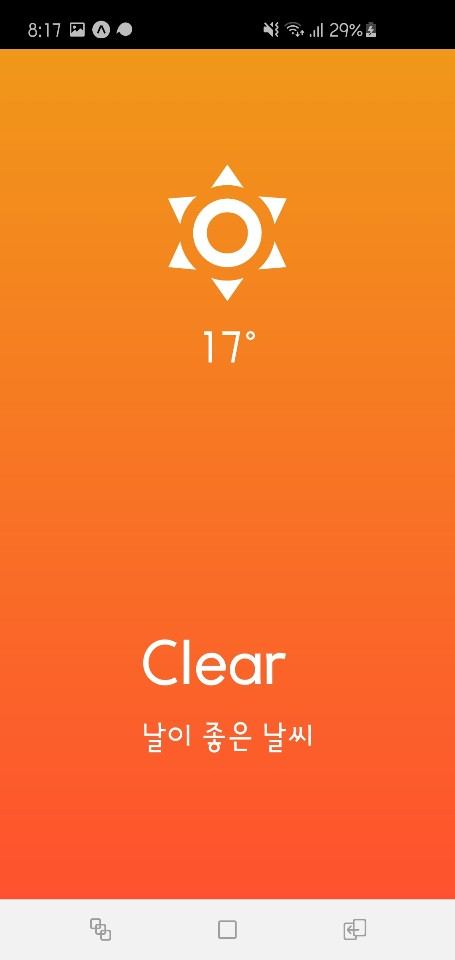
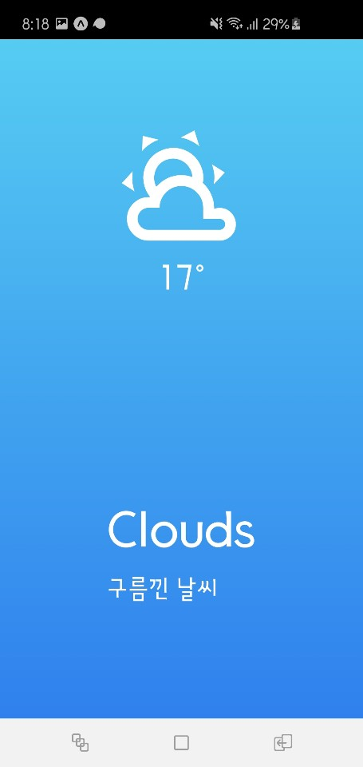
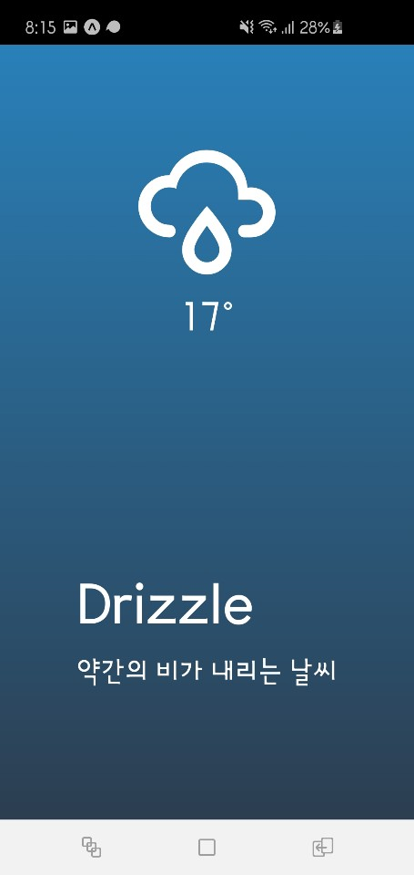
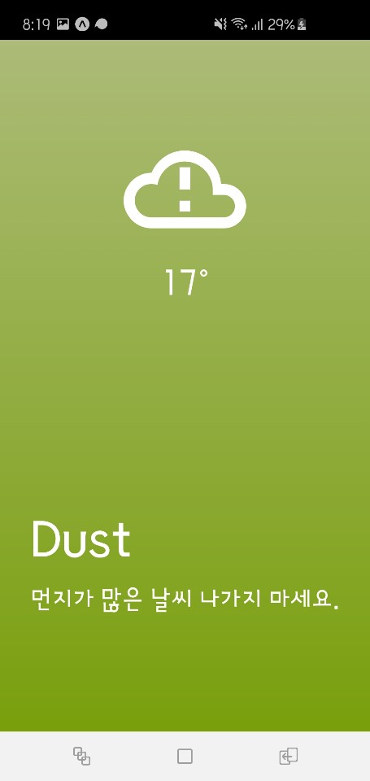
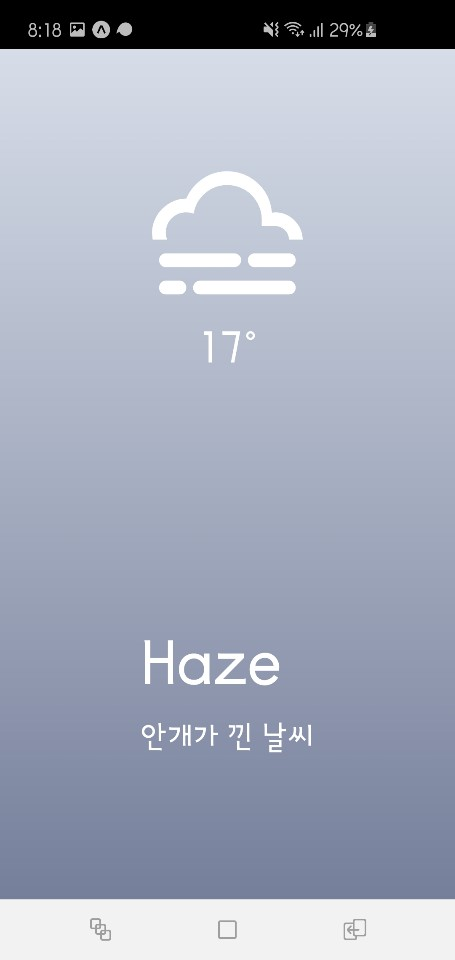
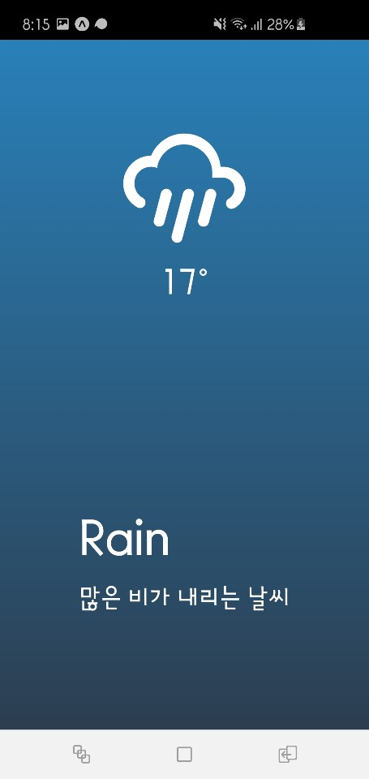
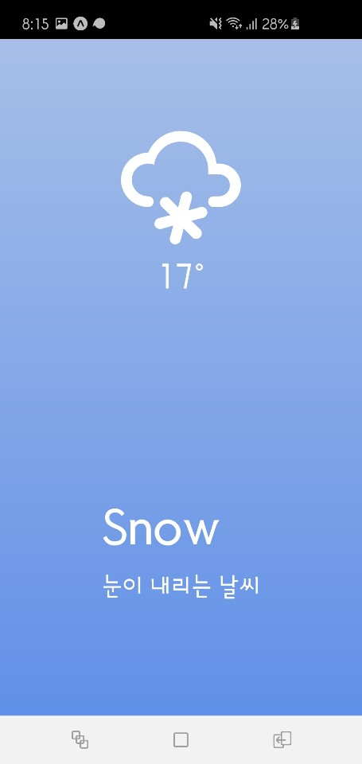
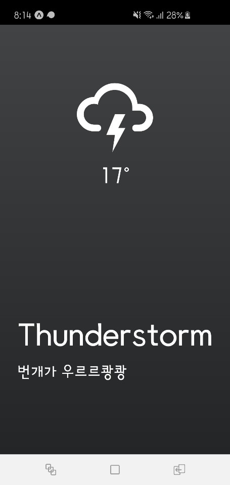

# Weather-app

## Class형 컴포넌트로 날씨앱을 만들어봄.

---

## 날씨API를 가져옴.

- longitude와 latitude는 위도와 경도이다.

```
await axios.get(
      `http://api.openweathermap.org/data/2.5/weather?lat=${latitude}&lon=${longitude}&appid=${API_KEY}&units=metric`
    );
```

## 날씨는 Clear, Clouds, Drizzle 등 8종류가 있다.

</img>
</img>
</img>
</img>
</img>
</img>
</img>
</img>
